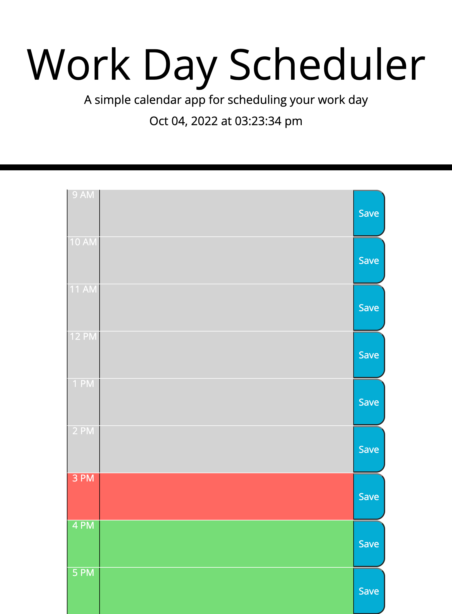

# Work day Scheduler

## Overview
- Work Day Scheduler to add daily events to your calendar

### Description 
Users are able to enter notes on a daily planner to create a schedule. The current day is displayed at the top of the calendar and the user is presented with time blocks for standard business hours.

## Usage
Users can click on the indicated time that they wish to use to input any specific note. Then, the note can be saved in their local storage by clicking the button "save" and once refreshed it will also stay on the page, until local storage is cleared. Each time block is color-coded to indicate whether it is in the past, present, or future.

## Resources

https://puentedg.github.io/Daily-notes/

https://github.com/puentedg/Daily-notes

## License
N/A
